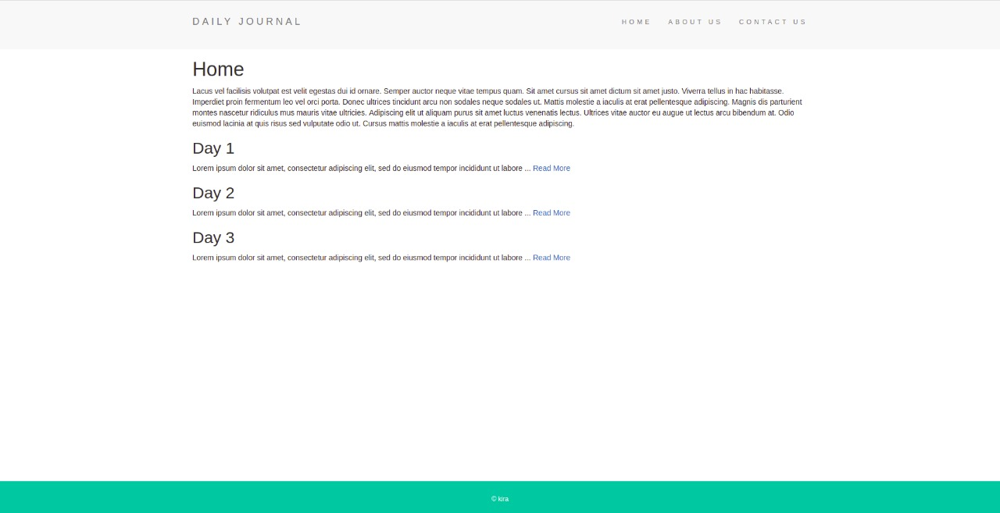

## Basic Blog Application

- Learning Express Routing
- Common interface and dynamic pages using EJS

### Routes:

- **/posts/postTitle** to view individual posts
- **/compose** to add new blog

### Home Page

